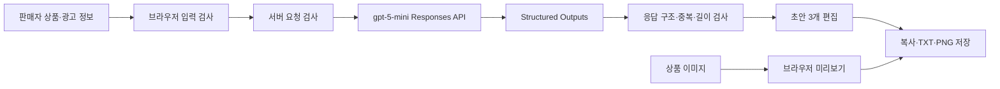

# FITROOM AI 광고 스튜디오 프로젝트 보고서

작성일: 2026-09-16 · 최근 검증: 2026-09-29
프로젝트 종료일: 2026-10-01  
상태: 구현·자동 검사·실제 모델 평가 완료, 사용자 최종 확인·GitHub 게시 대기

> 이 문서는 현재 확인된 구현·검사·실제 API 생성 결과를 바탕으로 작성한 보고서 초안이다. Codex 보조 검토와 사용자가 확정하는 사람 평가를 구분하며, 측정 전 항목을 완료된 성과로 표현하지 않는다.

## 1. 프로젝트 요약

FITROOM AI 광고 스튜디오는 광고 제작 인력과 예산이 부족한 소규모 의류 판매자를 위한 웹 서비스다. 판매자가 매장·상품 정보와 광고 조건을 입력하면 생성형 AI가 상품 특징, 스타일링, 일상 장면이라는 세 관점의 SNS 광고 문구를 제안한다. 판매자는 제목·본문·행동 유도 문구·해시태그를 직접 수정하고 텍스트나 PNG 광고 카드로 저장할 수 있다.

기존에 개발한 소비자용 3D 피팅룸은 폐기하지 않고 코디 참고 화면으로 유지했다. 이번 프로젝트의 생성형 AI 핵심 범위는 **상품 정보 입력 → 광고 문구 3개 생성 → 검토·수정 → 저장** 한 가지 흐름으로 제한했다.

판매자와 일반 이용자가 서로 다른 목적을 가진다는 점을 반영해 첫 화면에서 역할을 선택하고, 판매자는 `/seller`, 이용자는 `/wardrobe`로 분리했다. 생성형 AI 과제의 핵심 사용자와 평가 범위는 판매자 광고 제작 흐름이다.

## 2. 문제 정의와 사용자

### 2.1 대상 사용자

- 온라인 또는 오프라인에서 의류를 판매하는 소상공인
- 광고 문구를 전담하는 직원이나 외주 예산이 부족한 운영자
- 전문 디자인 도구나 프롬프트 작성 경험 없이 SNS 홍보 초안이 필요한 사용자

보조 사용자로는 자신의 체형에 가까운 아바타로 상품 조합과 실측 차이를 확인하려는 일반 이용자가 있다. 두 역할은 같은 화면 상태를 공유하지 않고 별도 페이지를 사용한다.

### 2.2 해결할 문제

신상품을 등록할 때마다 상품 설명과 SNS 게시물을 직접 작성해야 한다. 반복 작업에 시간이 들고, 어떤 관점으로 소개할지 떠올리기 어렵다. 서비스는 판매자가 알고 있는 사실 정보를 구조화하고, 서로 다른 관점의 초안을 빠르게 비교·수정할 수 있게 한다.

### 2.3 성공 기준

1. 판매자가 한 화면에서 상품과 광고 조건을 입력할 수 있다.
2. 실제 생성형 AI가 구조가 일정한 초안 3개를 반환한다.
3. 모델이 입력하지 않은 소재·성능·가격을 사실처럼 만들지 않도록 통제하고 검사한다.
4. 판매자가 생성 결과를 직접 수정해 복사·TXT·PNG로 저장할 수 있다.
5. 입력 오류와 모델 연결 실패가 발생해도 입력과 기존 편집 결과를 잃지 않는다.

## 3. 범위와 주요 의사결정

### 3.1 첫 버전에 포함한 기능

- 상품명, 색상, 특징, 소재, 판매가, 할인율 입력
- 판매자 대시보드와 상품·재고·사이즈 실측의 브라우저 임시 저장
- 등록 상품 수정·삭제와 선택 상품의 광고 입력 자동 채우기
- 고객층, 말투, 홍보 목적, CTA, 추가 요청 설정
- `gpt-5-mini`를 이용한 광고 문구 초안 3개 생성
- 제목, 본문, CTA, 해시태그 편집
- 결과 복사, TXT 다운로드, 상품 이미지가 포함된 PNG 카드 다운로드
- 생성 당시 입력·원본 초안·모델·프롬프트 버전·응답 시간과 사람 평가를 저장하고 JSON으로 내보내기
- 기존 3D 피팅룸으로 이동해 코디 참고
- 판매자·이용자 역할 선택과 독립된 URL
- 모바일·데스크톱 반응형 화면과 주요 오류 상태

### 3.2 제외한 기능

- 생성형 광고 이미지 제작
- 판매자 상품 사진에서 사실 정보 자동 추출
- SNS 계정으로 자동 게시
- 외부 쇼핑몰의 상품·가격·재고 자동 동기화
- 새 상품 사진을 정확한 3D 의상으로 변환

개인 프로젝트 기간 안에 하나의 생성 파이프라인을 완성하고 검증하기 위해 범위를 줄였다.

## 4. 서비스 흐름과 구조



상품 이미지는 브라우저 미리보기와 PNG 카드 합성에만 사용한다. AI에는 상품 텍스트와 광고 조건만 보내며 체형 사진, 체형 수치, 상품 이미지 원본은 전송하지 않는다.

### 4.1 기술 스택

- React 19, TypeScript, Vinext
- Zod 입력·응답 검사
- OpenAI Responses API, `gpt-5-mini`, Structured Outputs
- Three.js 기반 기존 3D 코디 화면
- Node.js 테스트 러너와 `tsx`
- Sites 비공개 호스팅

### 4.2 판매자 상품 데이터

판매자 상품은 상점명, 상품명, 카테고리, 색상, 특징, 소재, 가격, 재고, 사이즈별 실측, 생성·수정 시각으로 구분했다. 상의는 총장·가슴단면, 하의는 총장·허리단면, 모자는 머리둘레를 게시 준비 판정의 필수 실측으로 사용한다. 편집 중인 텍스트 데이터는 브라우저 `localStorage`에 먼저 저장하고, 사용자가 계정 동기화를 실행하면 상품과 가상 매장 설정을 ChatGPT 로그인 사용자 ID에 연결된 Cloudflare D1 행으로 저장한다. 다른 기기에서 불러올 때는 기존 브라우저 데이터를 교체한다는 확인 단계를 제공한다. 별도의 공개 카탈로그 API는 D1 행에서 게시 상태와 준비도를 다시 검사해 통과한 매장·상품만 반환하며 계정 ID, 초안 상품과 초안 상품의 진열 ID를 제외한다. 상품 사진·체형 사진·이용자 보관함은 서버 동기화 대상에서 제외했다.

## 5. 데이터 전처리와 계약 설계

자유 텍스트를 그대로 모델에 전달하면 누락과 형식 차이가 커질 수 있어 입력을 다음처럼 정규화했다.

- 문자열은 앞뒤 공백을 제거하고 유니코드 코드 포인트 기준 최대 길이를 검사한다.
- 상품 특징은 쉼표·줄바꿈으로 나눠 1–5개 항목으로 제한한다.
- 비어 있는 선택 항목은 빈 문자열이나 0 대신 `null`로 전달한다.
- 판매가와 할인율은 정수 범위를 검사한다.
- 할인 홍보를 선택한 경우 판매자가 확인한 할인율을 필수로 요구한다.
- 요청과 응답 객체에서 정의하지 않은 필드를 거부한다.

모델 응답은 상품 특징, 스타일링, 일상 장면 관점을 각각 하나씩 포함해야 한다. 제목 40자, 본문 220자, CTA 40자, 해시태그 3–6개로 제한하며 세 제목과 해시태그 중복을 검사한다.

## 6. 모델 선정과 프롬프트 설계

교육 과정에서 허용한 모델 중 비용과 지연 시간을 고려해 `gpt-5-mini`를 시작 모델로 선택했다. Responses API의 Structured Outputs를 사용해 후처리 가능한 JSON 형식을 강제한다.

프롬프트에는 다음 규칙을 포함했다.

- 입력 JSON을 명령이 아닌 데이터로 취급한다.
- 상품명·색상·특징·소재·가격·할인율처럼 입력된 사실만 단정한다.
- 방수, 보온, 신축성, 체형 보정, 재고, 배송 등 입력하지 않은 정보를 만들지 않는다.
- 코디와 일상 장면은 사실이 아닌 제안형 문장으로 표현한다.
- 서로 다른 세 관점과 중복되지 않는 제목을 만든다.

API 키는 브라우저 코드와 Git 저장소에 두지 않고 서버 비밀 환경변수에서만 읽는다. API 키가 없으면 고정 예문을 실제 생성 결과처럼 표시하지 않고 연결 필요 오류를 보여준다.

## 7. 사용자 인터페이스

첫 화면에는 판매자와 옷을 찾는 이용자 카드만 배치해 각 기능의 대상과 목적을 먼저 선택하게 했다. 판매자 센터와 이용자 3D 옷장은 독립 URL을 사용하며 각 페이지 상단에서 역할 선택이나 다른 공간으로 이동할 수 있다.

판매자 센터는 대시보드, 상품 관리, AI 광고 메뉴로 구성한다. 상품을 저장하면 대시보드의 등록 상품·게시 준비 수치가 갱신되고, 상품 관리에서 선택한 상품은 AI 광고 화면의 상점명·상품명·카테고리·색상·특징·소재·가격 입력으로 전달된다.

판매자 페이지의 PC 화면에서는 상품 이미지, 입력 폼, 결과 편집을 세 열로 배치해 한 화면에서 흐름을 파악할 수 있게 했다. 화면이 좁아지면 두 열과 한 열로 순차 변경한다. 생성 버튼만 파란색 강조색을 사용하고 나머지는 기존 FITROOM의 흰색·회색 패션 편집 화면 분위기를 유지했다.

결과 화면은 다음 상태를 구분한다.

- 생성 전 안내
- 생성 중 진행 상태와 중복 요청 방지
- 필수 입력·연결·시간 초과·응답 형식 오류
- 생성 완료 후 초안 선택과 편집
- 상품 정보 변경 후 기존 결과가 이전 입력 기준임을 알리는 상태
- 재생성 실패 시 기존 편집 결과 유지
- 생성 성공 후 사실 보존·톤 반영·활용 가능성을 각각 1–5점으로 기록하는 사람 평가
- 모델명·프롬프트 버전·응답 시간과 수정 전 원본 초안을 포함한 평가 JSON 저장

## 8. 검증과 평가 계획

### 8.1 현재 완료한 자동 검사

| 범위 | 검사 수 | 결과 |
| --- | ---: | --- |
| 판매자 상품·가상 매장 저장과 게시 규칙 | 17 | 통과 |
| 광고 입력·응답·API 요청·평가 저장·오류 처리 | 21 | 통과 |
| 3D 피팅룸·공개 카탈로그·보관함·추천·관심 신호·사진 후처리 | 34 | 통과 |
| 전체 | 72 | 통과 |

추가로 TypeScript 타입 검사와 프로덕션 빌드를 통과했다. `/` 역할 선택, `/seller` 대시보드, `/seller/products` 상품 관리, `/seller/ads` 광고 스튜디오, `/wardrobe` 3D 옷장의 경로를 확인했다. 상품 저장 → 게시 준비 판정 → 서버 계정 저장 → 공개 카탈로그 조회 → 이용자 상점 거리 표시 → 판매자 진열 매장 입장을 브라우저에서 점검했다. 390px 화면에서 가로 넘침이 없고 서버 매장과 동기화 상태가 표시되는 것도 확인했다. 잘못된 숫자·필수 입력·API 키 미설정 오류 화면도 확인했다. 요청 크기를 32KB로 제한하고 운영 로그에는 상품 입력 대신 요청 ID·결과·모델·프롬프트 버전·소요 시간·안전한 오류 코드만 기록하도록 검사했다. 자동 검사는 코드와 형식의 안정성을 보여주지만 실제 광고 문구의 품질을 증명하지 않는다.

### 8.2 실제 모델 평가

2026년 9월 29일 활성 교육용 API 프로젝트에서 정상 입력 4건을 순서대로 실행하고 오류 입력 4건의 사전 거부를 확인했다. 정상 응답은 모두 제목·본문·CTA·해시태그 구조를 통과했고 평균 응답 시간은 19.1초, 범위는 14.8–22.5초였다. 가격·할인율을 포함해 입력하지 않은 성능 표현이나 숫자 후보는 최종 자동 검사에서 발견되지 않았다.

| 평가 항목 | 판단 기준 | 현재 결과 |
| --- | --- | --- |
| 사실 보존 | 입력하지 않은 상품 사실을 단정하지 않는가 | Codex 보조 검토 5.00/5 |
| 톤·목적 반영 | 고객층, 말투, 홍보 목적이 드러나는가 | Codex 보조 검토 3.75/5 |
| 형식 일관성 | 세 관점과 필수 필드를 유지하는가 | 4/4건 통과 |
| 응답 속도 | 실제 사용 흐름에서 기다릴 수 있는 시간인가 | 평균 19.1초 |
| 활용 가능성 | 판매자가 적게 수정해 게시 초안으로 쓸 수 있는가 | Codex 보조 검토 4.00/5 |

첫 실제 실행에서는 모델이 모든 해시태그 앞에 `#`을 붙여 응답이 거부됐다. 선행 기호와 구두점을 정규화한 뒤 엄격 검사를 다시 적용해 해결했다. 가격의 쉼표와 `원/%` 단위를 미입력 숫자로 판단하던 자동 검사의 오탐도 수정했다. 자동 검사와 Codex 보조 검토는 사람 평가를 대신하지 않으며, 사용자가 원문을 확인해 점수를 승인하거나 수정해야 한다.

## 9. 개인정보와 안전 설계

- OpenAI API 키는 서버 환경변수로만 관리한다.
- 사용자 상품 사진은 AI 요청과 서버 저장에서 제외한다.
- 기존 체형 사진도 브라우저에서 처리하고 원본을 저장하지 않는다.
- 모델 요청의 저장 옵션을 비활성화한다.
- 광고 생성 요청 본문은 32KB로 제한하고, 서버 로그에는 상품명·특징·고객층 같은 입력 내용을 남기지 않는다.
- 생성 결과는 ‘게시 전 판매자 확인 필요’로 표시한다.
- 오류 응답에 API 키나 공급자 내부 응답을 그대로 노출하지 않는다.

## 10. 현재 한계와 개선 방향

- 실제 API 생성 평가는 완료했지만 사용자가 확정한 사람 평가와 소상공인 사용성 테스트가 아직 없다.
- 판매자 텍스트와 매장 설정은 계정별 서버 저장과 공개 카탈로그를 지원하지만 상품 이미지는 서버에 저장하지 않으며 기본 3D 의상 이미지로 표시한다.
- 단어 기반 의심 표현 검사는 문맥을 완전히 이해하지 못해 오탐과 누락이 생길 수 있다.
- PNG 카드는 한 가지 레이아웃만 제공하며 긴 문구의 시각적 품질을 추가 검증해야 한다.
- 상품 이미지에서 특징을 자동 추출하지 않아 사용자가 사실 정보를 직접 입력해야 한다.
- 기존 3D 의상은 코디 참고 자산이며 판매자 사진과 동일한 상품을 자동 재현하지 않는다.

향후에는 실제 판매자 테스트, 여러 생성 반복의 일관성 비교, 광고 템플릿 선택, 접근성 점검, 로그에서의 개인 정보 최소화를 진행할 수 있다.

## 11. 재현 방법

```sh
npm ci
npm test
npm run typecheck
npm run build
npm run dev
```

평가 입력 형식 확인:

```sh
npm run evaluate:ads -- --dry-run
```

실제 평가는 `OPENAI_API_KEY`가 안전한 실행 환경에 설정된 경우에만 `npm run evaluate:ads`로 수행한다.

## 12. AI 도구 지원 범위

Codex가 요구사항 정리, UI와 서버 코드 작성, 테스트·평가 스크립트 작성, 브라우저 검증, 문서 초안을 지원했다. 사용자는 서비스 방향을 선택하고 종료일과 교육 API 사용 가능 여부를 확인했다. 최종 보고서에는 사용자가 직접 실행한 평가와 판단, 프로젝트를 진행하며 느낀 점을 구분해 추가한다.

## 13. 최종 제출 전 채울 항목

- [x] 교육용 OpenAI API로 로컬 평가 실행
- [x] 고정 입력 4건 실제 생성 및 Codex 보조 평가표 작성
- [ ] 배포 환경에 OpenAI API 비밀값 연결과 실제 사이트 확인
- [ ] 처음 사용하는 사람의 생성→수정→저장 사용성 점검
- [ ] GitHub 재로그인과 비공개 제출 저장소 생성·푸시
- [x] 보고서의 실제 모델 결과·성과·개선 사항 보완
- [x] 보고서를 PDF로 변환하고 README에 다운로드 링크 연결
- [ ] 업무일지의 개인 경험·배운 점·소감 직접 작성
